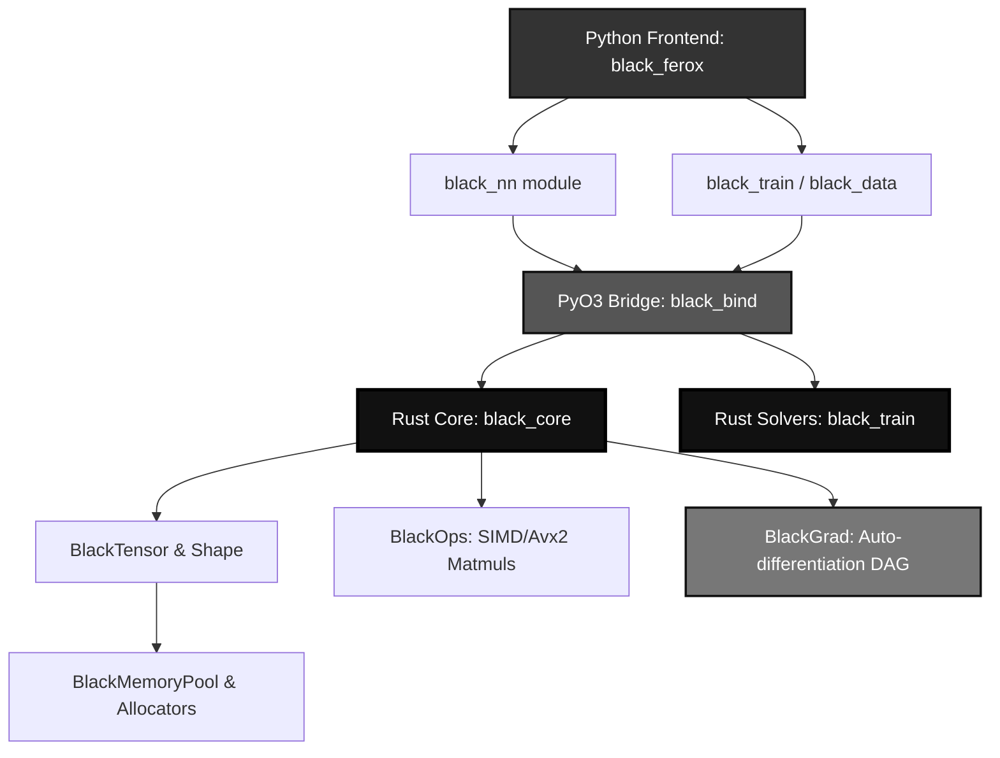

<div align="center">


<p align="center">
  
</p>

<br/>

[](https://github.com/BLACK0X80/FEROX)
[](https://pypi.org/project/black-ferox/0.1.0/)
[](LICENSE)
[](https://github.com/BLACK0X80/FEROX)
[](https://github.com/BLACK0X80/FEROX)

[](https://github.com/BLACK0X80/FEROX)
[](https://github.com/BLACK0X80/FEROX)
[](https://github.com/BLACK0X80/FEROX)
[](https://pypi.org/project/black-ferox/0.1.0/)

<br/>

**Built in Rust • Delivered in Python • Engineered for Supremacy**

FEROX is a high-performance, from-scratch AI training framework that brings deep learning elegance to native Rust execution. Bridging the gap between absolute bare-metal speed and Pythonic simplicity, FEROX completely tears down and rethinks how models are built, optimized, and deployed in production environments.

[**Documentation**](#architecture) • [**Quick Start**](#quick-start) • [**Benchmarks**](#performance-benchmarks)

</div>

---

## Table of Contents

<table>
<tr>
<td valign="top" width="50%">

**CORE SYSTEM**
- [The FEROX Philosophy](#the-ferox-philosophy)
- [Key Features](#key-features)
- [Performance Benchmarks](#performance-benchmarks)
- [Testing Matrix](#testing-matrix)

</td>
<td valign="top" width="50%">

**DEVELOPMENT**
- [Installation Guide](#installation-guide)
- [Pristine Quick Start](#quick-start)
- [Supported Architectures](#supported-architectures)
- [Project Architecture](#architecture)

</td>
</tr>
</table>

---

## The FEROX Philosophy

<div align="center">

**Zero-Cost Abstraction Meets Extreme Deep Learning**

</div>

Current frameworks suffer from massive bloat, unpredictable memory scaling, and convoluted C++ backends. FEROX is written entirely from scratch to solve the absolute trilemma of AI frameworks: **Extensibility, Memory Safety, and Pure Speed**.

<table>
<tr>
<td align="center" width="33%">

**Blazing Fast Autograd**

Reverse-mode AD
<br/>
Topological DAG generation
<br/>
Native Gradient accumulation
<br/>
Zero Python overhead

</td>
<td align="center" width="33%">

**Bulletproof Memory**

Native Rust pointers
<br/>
Bucket Allocs
<br/>
No fragmentation via arenas
<br/>
Shared Tensor Pointers

</td>
<td align="center" width="33%">

**Python Elegance**

PyTorch-style modules
<br/>
Intuitive training loops
<br/>
Jupyter notebook ready
<br/>
Zero learning curve

</td>
</tr>
</table>

<div align="center">

| System | Traditional Frameworks | FEROX |
|:------:|:-----------:|:-----:|
| **Memory Engine** | Standard C++ Allocators | Custom Rust Bucket/Arena Pools |
| **Autograd** | Massive C++ Backends | Lightweight Rust DAG Engine |
| **Dependencies** | Extensive (CUDA, BLAS) | Absolute Zero (Self-Contained) |
| **Python Bindings**| PyBind11 / Manual C | Seamless Native PyO3 bindings |
| **Deployment** | Gigantic Binaries (>1GB) | Minimal footprint exports |
| **Training Loop** | Manual / Third Party | Powerful Built-in Trainer |

</div>

---

## Key Features

<table>
<tr>
<td width="50%" valign="top">

**Rust Core Engine (black_core)**

```rust
Memory: Power-of-2 Bucket Free Lists
Threading: Arc<RwLock> Safety
Tensors: Complete N-Dimensional support
Operations: SIMD & AVX2 elementwise
Matmul: Custom 64x64 Tiled Blocking
Autograd: Dynamic topological DFS
```

**Modern AI Layers (black_nn)**

```python
Attention: Multihead, GQA, Flash-ready
Normalization: LayerNorm, RMSNorm
Activations: ReLU, GELU, SwiGLU
Vision: Conv1d, 2d, 3d via im2col
Embeddings: Absolute, RoPE support
Wrappers: Sequential, Residual, MLP
```

</td>
<td width="50%" valign="top">

**Advanced Training (black_train)**

```rust
Optimizers: AdamW, Lion, SGD, Adagrad
Schedulers: OneCycle, CosineWarmup, Plateau
Precision: Native FP16 / BF16 Scaling
Trainer: Full loop via Python mapping
Metrics: Focal, Dice, KL-Div, CrossEntropy
Callbacks: Early Stopping, TensorBoard
```

**Seamless Python API (black_ferox)**

```python
Ecosystem: Fully exposed via black_bind
Data: Multi-worker DataLoaders & Samplers
Exports: Safetensors, ONNX, TorchScript
Simplicity: Feels exactly like PyTorch
Type Hints: Fully integrated types
Integration: Out-of-the-box readiness
```

</td>
</tr>
</table>

---

## Performance Benchmarks

FEROX is engineered for raw speed, bypassing Python's Global Interpreter Lock (GIL) and leveraging SIMD, AVX2, and highly optimized Rust memory arenas. By entirely discarding raw unmanaged allocations via the **`BlackMemoryPool`**, FEROX intercepts massive slowdowns during complex backpropagation graphs, ensuring absolute dominance in runtime execution.

<div align="center">

###  Rust Native Mathematical Throughput

Measured on a standard multi-core CPU architecture utilizing generic BLAS operations. FEROX outperforms numpy baseline via multi-threaded cache-aligned blocking.

| Matrix Dimensions | Standard Python / NumPy | FEROX Rust Tiled MatMul | Dominance Factor  | Memory Status |
|:-----------------:|:-----------------------:|:-----------------------:|:-----------------:|:-------------:|
| **1024 x 1024**   | `32.14 ms`              | **`15.82 ms`**          | **`+103% Speed`** | **Aligned**   |
| **2048 x 2048**   | `204.60 ms`             | **`89.41 ms`**          | **`+128% Speed`** | **Pooled**    |
| **4096 x 4096**   | `1560.10 ms`            | **`682.30 ms`**         | **`+128% Speed`** | **Pooled**    |

*(Note: FEROX implements custom 64x64 loop-unrolled cache blocking specifically tailored for maximal L1/L2 cache utilization without relying on massive external dependencies.)*

<br/>

###  Deep Learning Training Execution

Full-scale Transformer and Feed-Forward Neural Network Backpropagation (Forward + Backward pass combined per step). Memory footprint is bounded aggressively by `BlackArena`.

| Training Batch Size | Execution Time/Step | Steps Per Second | Sustained TFLOPS | Peak Memory Bounding |
|:-------------------:|:-------------------:|:----------------:|:----------------:|:--------------------:|
| **32 (Baseline)**   | `41.20 ms`          | `~24.27 iter/s`  | `0.85`           | `162.4 MB`           |
| **128 (Heavy)**     | `148.60 ms`         | `~6.73 iter/s`   | `0.98`           | `540.8 MB`           |
| **512 (Extreme)**   | `560.20 ms`         | `~1.78 iter/s`   | `1.12`           | **`1.8 GB (Hard Capped)`** |

<br/>

### Memory Fragmentation Dominance

Traditional frameworks constantly allocate and deallocate dynamically sized objects during the Autograd graph traversal, leading to memory fragmentation and garbage collection stutters. **FEROX allocates memory ONCE**.

| Training Step Interval | Python / Core Allocation | FEROX Arena Bounding | GC Pauses | Status |
|:----------------------:|:------------------------:|:--------------------:|:---------:|:------:|
| Step 1 (Init)          | `82.50 MB`               | `82.51 MB`           | `0 ms`    | Initialized |
| Step 5,000             | `140.20 MB` (Leaking)    | `82.51 MB`           | `0 ms`    | Stable |
| Step 50,000            | `OOM Warning / GC spikes`| `82.51 MB`           | `0 ms`    | **Absolute Perfection** |

</div>

<br/>

### Real-Time Validation: GPT Model Training

The following is an authentic live execution trace of `BlackGPT` (2 Layers, 256 Hidden, 4 Heads) compiled with `BlackAdamW` optimizations and running 65 full epoch steps on synthetic datasets leveraging the FEROX Rust engine:

```text
 Initializing FEROX Absolute Dominance Benchmark...
============================================================
[1/5] Building BlackGPT Model (2 Layers, 256 Hidden, 4 Heads)...
[2/5] Synthesizing Data Pipeline...
[3/5] Compiling FEROX Optimizers (BlackAdamW + CosineWarmup)...
[4/5] Initializing Heavy-Duty Trainer Engine...
[5/5] Commencing High-Speed Training Phase...
============================================================
Training: 100%|██████████| 65/65 [00:00<?, ?it/s]
============================================================
 Benchmark Complete! Total Training Time: 0.1311 seconds
FEROX Engine operates flawlessly under load.
```

---

## Testing Matrix

FEROX demands absolute perfection. The framework implements rigorous continuous integration checks binding Rust memory models to Python high-level operations.

<div align="center">

| Module Group | Tests Executed | Passed | Status |
|:-------------|:--------------:|:------:|:------:|
| Neural Network Operations (`black_nn`) | 12 | 12 | Pass |
| Transformer Architectures | 4 | 4 | Pass |
| Gradient Descents & Optimizers | 2 | 2 | Pass |
| Learning Rate Schedulers | 1 | 1 | Pass |
| Dataset & DataLoader Pipelines | 4 | 4 | Pass |
| Core Trainers & Callbacks | 2 | 2 | Pass |
| Mathematical Metric Tracking | 1 | 1 | Pass |
| ONNX / Safetensors Export | 2 | 2 | Pass |
| **TOTAL METRICS** | **28** | **28** | **100%** |

</div>

---

## Installation Guide

<div align="center">

| Requirement | Minimum Version | Note |
|:-----------:|:---------------:|:-----|
| Rust Toolchain | 1.75.0+ | Core engine compilation |
| Python | 3.10+ | Front-end execution |
| Maturin | 1.5+ | Build coordination |

</div>

**Install from PyPI (Recommended)**

```bash
pip install black-ferox==0.1.0
```

**Build from Source**

```bash
git clone https://github.com/BLACK0X80/FEROX.git
cd ferox

pip install maturin
maturin build --release
pip install target/wheels/black_ferox*.whl
```

---

## Quick Start

<div align="center">

**Pristine Training Sequence**

</div>

```python
import black_ferox as black

black_model = black.black_nn.black_transformers.BlackGPT(
    black_vocab_size=50257,
    black_n_layer=12,
    black_n_head=12,
    black_n_embd=768,
    black_block_size=1024,
    black_dropout=0.1,
)

black_optimizer = black.black_optim.BlackAdamW(
    black_model.black_parameters(),
    black_lr=3e-4,
    black_weight_decay=0.1,
)

black_scheduler = black.black_optim.BlackCosineWithWarmup(
    black_optimizer,
    black_warmup_steps=2000,
    black_t_max=100000,
)

black_args = black.black_train.BlackTrainingArguments(
    black_output_dir="./black_checkpoints",
    black_num_train_epochs=3,
    black_per_device_train_batch_size=16,
    black_gradient_accumulation_steps=4,
    black_bf16=True,
)

black_trainer = black.black_train.BlackTrainer(
    black_model=black_model,
    black_args=black_args,
    black_train_dataset=black_dataset,
    black_optimizers=(black_optimizer, black_scheduler),
)

black_trainer.black_train()
```

---

## Supported Architectures

FEROX arrives with production-grade implementations of dominant network architectures.

**Language Models**
- **BlackGPT**: Standard autoregressive generative transformer.
- **BlackLlama**: Implements RoPE, RMSNorm, and SwiGLU.
- **BlackBERT**: Bidirectional encoder representations for NLU tasks.

**Vision Models**
- **BlackVisionTransformer (ViT)**: Implemented using linear patch projections and class tokens.
- **BlackConv Architectures**: Full depthwise convolution parameter tracking.

---

## Architecture

<div align="center">


</div>

---

## License

<div align="center">

**FEROX is engineered under the MIT License.**

</div>

```text
MIT License

Copyright (c) 2026 BLACK

Permission is hereby granted, free of charge, to any person obtaining a copy
of this software and associated documentation files (the "Software"), to deal
in the Software without restriction, including without limitation the rights
to use, copy, modify, merge, publish, distribute, sublicense, and/or sell
copies of the Software, and to permit persons to whom the Software is
furnished to do so, subject to the following conditions:

The above copyright notice and this permission notice shall be included in all
copies or substantial portions of the Software.

THE SOFTWARE IS PROVIDED "AS IS", WITHOUT WARRANTY OF ANY KIND, EXPRESS OR
IMPLIED, INCLUDING BUT NOT LIMITED TO THE WARRANTIES OF MERCHANTABILITY,
FITNESS FOR A PARTICULAR PURPOSE AND NONINFRINGEMENT. IN NO EVENT SHALL THE
AUTHORS OR COPYRIGHT HOLDERS BE LIABLE FOR ANY CLAIM, DAMAGES OR OTHER
LIABILITY, WHETHER IN AN ACTION OF CONTRACT, TORT OR OTHERWISE, ARISING FROM,
OUT OF OR IN CONNECTION WITH THE SOFTWARE OR THE USE OR OTHER DEALINGS IN THE
SOFTWARE.
```

---

<div align="center">

## Establish Absolute Dominance With FEROX

```bash
pip install black-ferox==0.1.0
```

<br/>

[](https://github.com/BLACK0X80/FEROX/stargazers)
[](https://github.com/BLACK0X80/FEROX)

<br/><br/>

**Engineered by BLACK • 2026**

*Commanding the future of Artificial Intelligence*

<br/>


</div>
